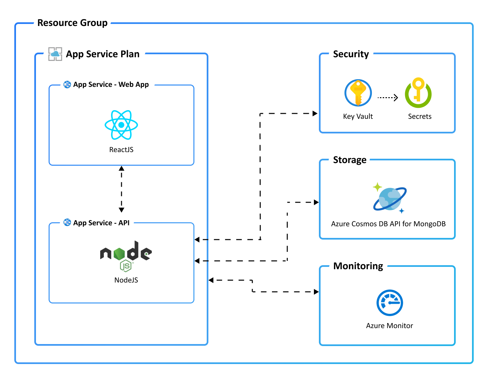

# CI/CD Pipeline for an Interactive Ticket Master App on Azure

## Description: 
Thisproject involves building a complete customer ticketing app hosted on Azure App Service with Node.js API and Azure Cosmos API for MongoDB for storage. In the project I use Azure Developer CLI modules from Microsoft Learn.

## The Application Architecture

This application utilizes the following Azure resources:

- [**Azure App Services**](https://docs.microsoft.com/azure/app-service/) to host the Web frontend and API backend
- [**Azure Cosmos DB API for MongoDB**](https://docs.microsoft.com/azure/cosmos-db/mongodb/mongodb-introduction) for storage
- [**Azure Monitor**](https://docs.microsoft.com/azure/azure-monitor/) for monitoring and logging
- [**Azure Key Vault**](https://docs.microsoft.com/azure/key-vault/) for securing secrets

Here's a high level architecture diagram that illustrates these components. Notice that these are all contained within a single [resource group](https://docs.microsoft.com/azure/azure-resource-manager/management/manage-resource-groups-portal).

## 0. Environment setup
### 0.0. Prerequisites

I use the Azure Developer CLI (azd) for streamlined provisioning and deployment to Azure. It has the following features: 

- simple commands for workflow steps
- a library of reusable, extensible templates that are pre-configured for common scenarios
- the ability to convert existing projects into new azd templates
- portable, reusable infrastructure as code scaffolding for the project
- compatibility and support for CI/CD pipelines and monitoring

I also use the [Node.js with npm (18.17.1+)](https://nodejs.org/) with npm (Node Package Manager) for API and Web development.

### 0.1. Application Code

I use an existing template for an interactive Web App hosted on Azure. The blueprint includes a server-side application written in Node.js, which serves as a server-side API, MongoDB on Azure for data storage, and a sample interactive application code (a ToDo web app) for user-side functionality. 

For specifics please see file: [Initial Setup](0_env_setup.ipynb)

## 1. Provision and Deploy the Application Architecture

### 1.1. Breakdown of the process in three steps

I need to package the app, provision the necessary hosting infrastructure and deploy the web app. This can be initiated with one command `azd up` that runs the three separate commands in sequence:

a. `azd package` for packing web app 
b. `azd provision` for provisioning infrastructure
c. `azd deploy` for deploying web app hosted on provisioned infrastructure

For specifics and images check this file: [Provision and Deploy](1_node_app_deploy.ipynb)

## 2. Monitoring Options

There are three monitoring dashboards: overview, live metrics and logs. See the [Monitoring Options](2_monitoring_options.ipynb) for specifics and demo images.

## 3. Customise Web Application Code 
In this project, website owner wants to use the interactive template for tracking customer tickets.

I use text editor to change the source code and then a granular `azd deploy` command to edit text in the web app without affecting the underlying infrastructure. This saves time. For specifics, see [Edit source code](3_customise_source_code.ipynb).

It is also possible to change the code by updating the whole environment with the`azd up` command.

## 4. Customise infrastructure code 

The company also needs to provide functionality for customers to upload their documents. Current infrastructure does not have any storage allocated, so I need to introduce the infrastructure. 

I edit infrastructure code files with a text editor and then use the granular `azd provision` to change infrastructure without executing application code. For specifics, see [Edit IaaC](4_customise_infrastructure.ipynb)  

I can also update the whole environment by running the`azd up` command again.

## 5. Configure a CI/CD Pipeline

In the previous steps, the workflows were managed by individual commands. I now automate these workflows with a CI/CD pipeline. I test it by pushing the commit to the Github Repo to see if the pipeline re-runs, incorporating changes to the source code and infrastructure code. The result should be a new website called 'Ticket Master' with an associated Azure storage.

### 5.1. Setup pipeline in Github

I run a pipeline in GitHub Actions and then check if it automatically re-runs when I push a commit with edited README file. When the workflow completes, I check if the custom changes to the source code (replacing 'Todo' with 'Ticket Master') and infrastructure (creating storage for the database) are replicated.   

For details and images of the process, see [CI/CD](5_cicd.ipynb).

## 6. Clean Up and Release Resources

[`azd down`](https://learn.microsoft.com/azure/developer/azure-developer-cli/reference#azd-down) - to delete all the Azure resources created with this template 

## 7. Security

### 7.1. Roles

This template creates a [managed identity](https://docs.microsoft.com/azure/active-directory/managed-identities-azure-resources/overview) for the app inside the Azure Active Directory tenant. It is used to authenticate the  app with Azure and other services that support Azure AD authentication like Key Vault via access policies. 

### 7.2. Key Vault

This template uses [Azure Key Vault](https://docs.microsoft.com/azure/key-vault/general/overview) to securely store the Cosmos DB connection string for the provisioned Cosmos DB account. Key Vault is a cloud service for securely storing and accessing secrets (API keys, passwords, certificates, cryptographic keys) and makes it simple to give other Azure services access to them. 

## 8. Tools

Azure Developer CLI, Windows PowerShell, Git Hub

Git Bash, Visual Studio Code, Vim text editor 
